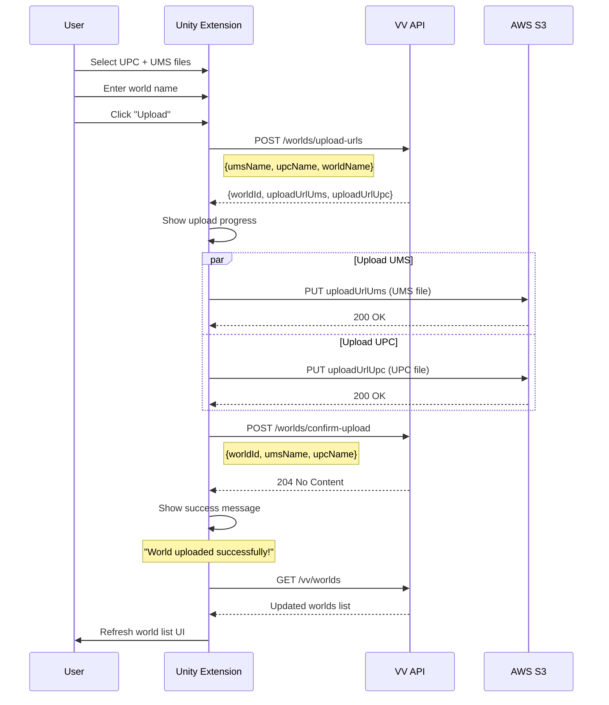

# World Publisher Extension API Guide

This guide documents the VirtualVenues World Publisher API for Unity developers building a World Publisher extension. Users can upload UPC and UMS World Maps through Unity, which will appear in the VirtualVenues web app.

## Table of Contents

- [Authentication](#authentication)
- [API Endpoints](#api-endpoints)
  - [Upload World Maps](#upload-world-maps)
  - [List Worlds](#list-worlds)
  - [Rename World](#rename-world)
  - [Delete World](#delete-world)
- [Upload Flow](#upload-flow)
- [Data Models](#data-models)
- [UX Guidelines](#ux-guidelines)
- [Error Handling](#error-handling)
- [Security Considerations](#security-considerations)

---

## Authentication

All API endpoints require authentication via Auth0 JWT tokens.

### Obtaining a Token

The Unity extension should use Auth0's device authorization flow or native authentication to obtain an access token. Include the token in all API requests:

```
Authorization: Bearer <access_token>
```

### Token Refresh

Tokens expire after a set period. Implement automatic token refresh to maintain user sessions without re-authentication.

---

## API Endpoints

Base URL: `https://api.virtualvenues.com` (production) or your configured API endpoint.

### Upload World Maps

World upload is a two-step process: request presigned URLs, upload files to S3, then confirm the upload.

#### Step 1: Request Upload URLs

```http
POST /worlds/upload-urls
Content-Type: application/json
Authorization: Bearer <access_token>
```

**Request Body:**

```json
{
  "umsName": "my-world.ums",
  "upcName": "my-world.upc",
  "worldName": "My Custom World"
}
```

| Field | Type | Required | Description |
|-------|------|----------|-------------|
| `umsName` | string | Yes | Filename for the UMS world map file |
| `upcName` | string | Yes | Filename for the UPC world map file |
| `worldName` | string | No | Display name for the world (can be set later) |

**Response (200 OK):**

```json
{
  "worldId": "550e8400-e29b-41d4-a716-446655440000",
  "uploadUrlUms": "<presigned-s3-url>",
  "uploadUrlUpc": "<presigned-s3-url>"
}
```

| Field | Type | Description |
|-------|------|-------------|
| `worldId` | string | Unique identifier for this world (UUID) |
| `uploadUrlUms` | string | Presigned S3 URL for UMS file upload (expires in 15 min) |
| `uploadUrlUpc` | string | Presigned S3 URL for UPC file upload (expires in 15 min) |

> **Important:** The presigned URLs are for internal use only. Do NOT display these URLs to the end user.

#### Step 2: Upload Files to S3

Upload both files using HTTP PUT requests to the presigned URLs:

```http
PUT <uploadUrlUms>
Content-Type: application/octet-stream

<UMS file binary data>
```

```http
PUT <uploadUrlUpc>
Content-Type: application/octet-stream

<UPC file binary data>
```

**Response:** 200 OK on success

#### Step 3: Confirm Upload

After both files are uploaded to S3, confirm the upload to save the world metadata:

```http
POST /worlds/confirm-upload
Content-Type: application/json
Authorization: Bearer <access_token>
```

**Request Body:**

```json
{
  "worldId": "550e8400-e29b-41d4-a716-446655440000",
  "umsName": "my-world.ums",
  "upcName": "my-world.upc",
  "worldName": "My Custom World"
}
```

| Field | Type | Required | Description |
|-------|------|----------|-------------|
| `worldId` | string | Yes | The worldId returned from upload-urls |
| `umsName` | string | Yes | Same filename used in upload-urls |
| `upcName` | string | Yes | Same filename used in upload-urls |
| `worldName` | string | No | Display name (overrides name from upload-urls) |

**Response:** 204 No Content on success

---

### List Worlds

Retrieve all worlds available to the current user.

```http
GET /vv/worlds
Authorization: Bearer <access_token>
```

**Response (200 OK):**

```json
{
  "worlds": [
    {
      "worldId": "550e8400-e29b-41d4-a716-446655440000",
      "worldName": "My Custom World",
      "userId": "auth0|123456789",
      "updatedAt": "2025-01-15T10:30:00Z",
      "isDefault": false
    },
    {
      "worldId": "default-arena",
      "worldName": "Arena",
      "userId": "system",
      "updatedAt": "2024-06-01T00:00:00Z",
      "isDefault": true
    }
  ]
}
```

| Field | Type | Description |
|-------|------|-------------|
| `worldId` | string | Unique identifier for the world |
| `worldName` | string | Display name of the world |
| `userId` | string | Owner's user ID |
| `updatedAt` | string | ISO 8601 timestamp of last update |
| `isDefault` | boolean | True if this is a system-provided default world |

> **Note:** Default worlds (`isDefault: true`) are provided by VirtualVenues and cannot be renamed or deleted by users.

---

### Rename World

Update the display name of a user's world.

```http
PUT /vv/worlds/{worldId}
Content-Type: application/json
Authorization: Bearer <access_token>
```

**Path Parameters:**

| Parameter | Description |
|-----------|-------------|
| `worldId` | The unique identifier of the world to rename |

**Request Body:**

```json
{
  "worldName": "Updated World Name"
}
```

**Response:** 204 No Content on success

**Error Responses:**

| Status | Description |
|--------|-------------|
| 404 | World not found or not owned by user |
| 400 | Invalid request (empty name, etc.) |

---

### Delete World

Delete a user's world. This removes both the metadata and the uploaded files.

```http
DELETE /worlds/{worldId}
Authorization: Bearer <access_token>
```

**Path Parameters:**

| Parameter | Description |
|-----------|-------------|
| `worldId` | The unique identifier of the world to delete |

**Response:** 204 No Content on success

**Error Responses:**

| Status | Description |
|--------|-------------|
| 404 | World not found or not owned by user |
| 409 | World is currently assigned to an event (cannot delete) |

> **Important:** A world cannot be deleted if it is currently assigned to any event. The user must first change or remove the world assignment from all events using this world.

---

## Upload Flow



### Flow Steps

1. **User Input**: User selects UPC and UMS files and optionally enters a world name
2. **Request URLs**: Extension calls `/worlds/upload-urls` to get presigned S3 URLs
3. **Upload Files**: Extension uploads both files to S3 in parallel
4. **Confirm Upload**: Extension calls `/worlds/confirm-upload` to save metadata
5. **Success Feedback**: Extension shows success message and refreshes world list

---

## Data Models

### World

```typescript
interface World {
  worldId: string       // Unique identifier (UUID)
  worldName: string     // Display name
  userId: string        // Owner's Auth0 user ID
  updatedAt: string     // ISO 8601 timestamp
  isDefault: boolean    // True for system-provided worlds
}
```

### Upload Request

```typescript
interface UploadUrlsRequest {
  umsName: string       // UMS filename (required)
  upcName: string       // UPC filename (required)
  worldName?: string    // Display name (optional)
}

interface UploadUrlsResponse {
  worldId: string       // Generated UUID for this world
  uploadUrlUms: string  // Presigned S3 URL for UMS
  uploadUrlUpc: string  // Presigned S3 URL for UPC
}

interface ConfirmUploadRequest {
  worldId: string       // From upload-urls response
  umsName: string       // Same as upload-urls request
  upcName: string       // Same as upload-urls request
  worldName?: string    // Can override name from upload-urls
}
```

---

## UX Guidelines

### World List View

Display worlds as a card grid with the following information:

| Element | Description |
|---------|-------------|
| World Name | Primary display text, editable for user's own worlds |
| Upload Date | Formatted date (e.g., "Jan 15, 2025") |
| Default Badge | Visual indicator for system-provided worlds |
| Actions | Edit name, Delete (disabled for defaults and in-use worlds) |

**Example Layout:**

```
┌─────────────────────────┐  ┌─────────────────────────┐
│  🌍 My Custom World     │  │  🌍 Arena        [Default]│
│                         │  │                         │
│  Uploaded: Jan 15, 2025 │  │  System provided        │
│                         │  │                         │
│  [Edit] [Delete]        │  │  [—] [—]               │
└─────────────────────────┘  └─────────────────────────┘
```

### Upload Interface

1. **File Selection**
   - Allow selecting UPC and UMS files together or separately
   - Validate file extensions (.upc, .ums)
   - Show selected file names

2. **World Name Input**
   - Text field for world name
   - Default to filename if not provided
   - Max length: 100 characters

3. **Upload Button**
   - Disabled until both files are selected
   - Shows loading state during upload

4. **Progress Indication**
   - Progress bar showing combined upload progress
   - Spinner during confirm-upload step
   - Clear success/error states

### Rename Interface

1. **Inline Edit Mode**
   - Click "Edit" to enable text input
   - Show Save/Cancel buttons
   - Revert on Cancel or Escape key

2. **Validation**
   - Require non-empty name
   - Trim whitespace
   - Max length: 100 characters

### Delete Interface

1. **Confirmation Dialog**
   - "Are you sure you want to delete [World Name]?"
   - Explain that this action cannot be undone
   - Require explicit confirmation (button click, not just Enter)

2. **Disabled State**
   - Disable delete button for default worlds
   - Disable and show tooltip for worlds assigned to events
   - Tooltip: "This world is being used by an event"

### Success Messages

Show user-friendly success messages:

| Action | Message |
|--------|---------|
| Upload | "World uploaded successfully!" |
| Rename | "World renamed successfully!" |
| Delete | "World deleted successfully!" |

> **Important:** Never display S3 URLs, presigned URLs, or internal identifiers to the user.

### Error Messages

| Scenario | User-Facing Message |
|----------|---------------------|
| Upload failed | "Upload failed. Please try again." |
| File too large | "File is too large. Maximum size is X MB." |
| Invalid file type | "Please select valid UPC and UMS files." |
| Network error | "Connection error. Please check your internet." |
| World in use | "Cannot delete: this world is assigned to an event." |
| Not found | "World not found." |

---

## Error Handling

### HTTP Status Codes

| Status | Meaning | Action |
|--------|---------|--------|
| 200 | Success | Process response |
| 204 | Success (no content) | Operation completed |
| 400 | Bad Request | Show validation error to user |
| 401 | Unauthorized | Prompt re-authentication |
| 403 | Forbidden | Show permission error |
| 404 | Not Found | Show "not found" message |
| 409 | Conflict | Handle specific conflict (e.g., world in use) |
| 500 | Server Error | Show generic error, offer retry |

### Retry Logic

Implement exponential backoff for transient failures:

```
Attempt 1: Immediate
Attempt 2: Wait 1 second
Attempt 3: Wait 2 seconds
Attempt 4: Wait 4 seconds
Max attempts: 4
```

### S3 Upload Errors

Handle S3 upload failures gracefully:

1. If UMS upload fails, do not proceed with UPC upload
2. If either upload fails, show error and allow retry
3. Do not call confirm-upload unless both S3 uploads succeed

---

## Security Considerations

### What to Hide from Users

The following should NEVER be displayed to end users:

| Data | Reason |
|------|--------|
| Presigned S3 URLs | Exposes internal infrastructure |
| Raw S3 bucket paths | Security risk |
| Internal user IDs | Privacy concern |
| Error stack traces | Security risk |

### What to Show to Users

| Data | Display As |
|------|------------|
| World ID | Only if needed for support tickets |
| World Name | Always visible |
| Upload Date | Formatted date string |
| File Names | During upload confirmation |

### Token Storage

- Store access tokens securely (Unity's secure storage APIs)
- Never log tokens to console or files
- Clear tokens on logout

### File Validation

- Validate file extensions on the client
- Do not trust file extensions alone (server validates content)
- Implement reasonable file size limits

---

## Example Implementation

### Unity C# Upload Example

```csharp
public async Task<bool> UploadWorld(string umsPath, string upcPath, string worldName)
{
    // Step 1: Get upload URLs
    var urlRequest = new UploadUrlsRequest
    {
        UmsName = Path.GetFileName(umsPath),
        UpcName = Path.GetFileName(upcPath),
        WorldName = worldName
    };
    
    var urlResponse = await api.PostAsync<UploadUrlsResponse>(
        "/worlds/upload-urls", 
        urlRequest
    );
    
    // Step 2: Upload files to S3 (parallel)
    var umsTask = UploadToS3(urlResponse.UploadUrlUms, umsPath);
    var upcTask = UploadToS3(urlResponse.UploadUrlUpc, upcPath);
    
    await Task.WhenAll(umsTask, upcTask);
    
    if (!umsTask.Result || !upcTask.Result)
    {
        ShowError("Upload failed. Please try again.");
        return false;
    }
    
    // Step 3: Confirm upload
    var confirmRequest = new ConfirmUploadRequest
    {
        WorldId = urlResponse.WorldId,
        UmsName = urlRequest.UmsName,
        UpcName = urlRequest.UpcName
    };
    
    await api.PostAsync("/worlds/confirm-upload", confirmRequest);
    
    // Success - show user-friendly message
    ShowSuccess("World uploaded successfully!");
    return true;
}

private async Task<bool> UploadToS3(string presignedUrl, string filePath)
{
    using var request = new UnityWebRequest(presignedUrl, "PUT");
    request.uploadHandler = new UploadHandlerFile(filePath);
    
    await request.SendWebRequest();
    
    return request.result == UnityWebRequest.Result.Success;
}
```

### Fetching and Displaying Worlds

```csharp
public async Task RefreshWorldList()
{
    var response = await api.GetAsync<WorldsResponse>("/vv/worlds");
    
    foreach (var world in response.Worlds)
    {
        var card = CreateWorldCard();
        card.SetName(world.WorldName);
        card.SetDate(FormatDate(world.UpdatedAt));
        card.SetIsDefault(world.IsDefault);
        
        if (!world.IsDefault)
        {
            card.EnableEdit(() => OnEditWorld(world.WorldId));
            card.EnableDelete(() => OnDeleteWorld(world.WorldId, world.WorldName));
        }
    }
}
```

---

## Appendix: API Changes Summary

The following changes are being implemented to support the full World Publisher functionality:

| Endpoint | Change | Status |
|----------|--------|--------|
| `POST /worlds/upload-urls` | Add `worldName`, generate unique `worldId` | Planned |
| `POST /worlds/confirm-upload` | Accept `worldId` parameter | Planned |
| `DELETE /worlds/{worldId}` | New endpoint with event-check protection | Planned |
| `GET /vv/worlds` | Already available | ✅ Available |
| `PUT /vv/worlds/{worldId}` | Already available | ✅ Available |

---

## Support

For API issues or questions, contact the VirtualVenues development team.

